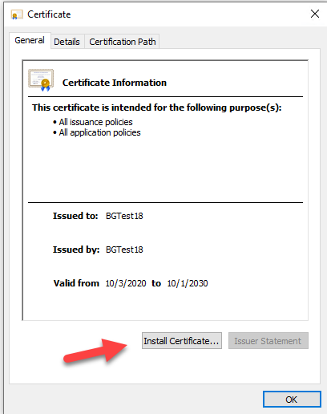
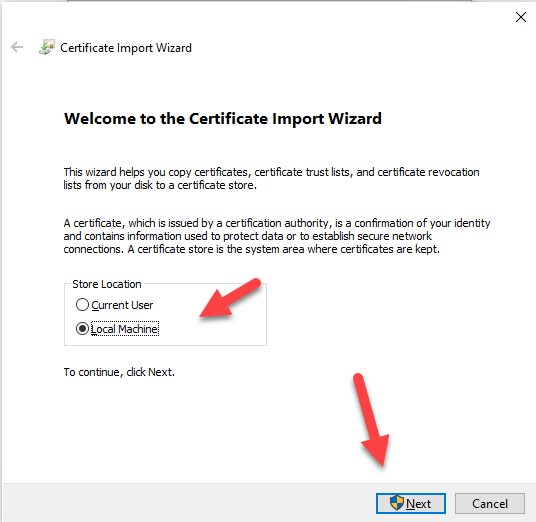
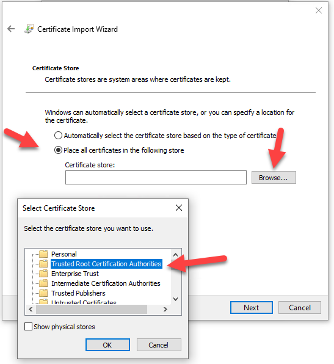

# Setting up SSL for tabs in the new Teams Toolkit

I've started using the new Microsoft Teams toolkit and am really liking it! However there is a little challenge when creating tabs, and that's due to the requirement to use SSL. The documentation is fine and [explains how to trust your local project](https://docs.microsoft.com/microsoftteams/platform/toolkit/visual-studio-code-overview?WT.mc_id=m365-blog-rogerman#add-a-trusted-certificate-for-localhost), but I found it a little painful when working on many projects since each one gets a different HTTPS certificate and I need to keep repeating the process. Your teammates will need to do that as well.

Here is an alternative approach in which you create your own certificate authority and build certs from that so you can install just one root certificate across all your projects! Each teammate can have their own certs, so you can collaborate as much as you wish and nobody has to go installing certs.

> NOTE: Did you know that the Teams Toolkit uses [Create React App (CRA)](https://reactjs.org/docs/create-a-new-react-app.html) for tabs? Create React App is a toolchain from Facebook (who created React in the first place) it's very popular and well supported! If you need help, search on "Create React App" and you can find a plethora of helpful articles; [this one](https://dev.to/ganeshagrawal/how-to-setup-https-locally-with-create-react-app-e46) helped me figure this out!

## Step 1: Create and trust a certificate authority (CA)

This step only needs to be done once for as many projects as you wish. It assumes you already have Node.js installed, as required by the Teams Toolkit.

**a.** Create a safe/private folder somewhere and go there in your favorite command-line tool, and run these commands:

~~~bash
npm install -g mkcert
mkcert create-ca --organization "MyOrg" --validity 3650
mkcert create-cert --ca-key "ca.key" --ca-cert "ca.crt" --validity 3650
~~~

> NOTE: 3650 is the number of days your certs will be valid; feel free to change it. You can use `--help` on `mkcert` to reveal other options, such as setting an organization name and location (the default org is "Test CA") and customizing the domain names for your certificate (the default is "localhost,127.0.0.1").

This will create a new Certificate Authority and a certificate that was issued from it. You should see 4 files:

| File | Description |
|---|---|
| ca.crt | Certificate for your new CA |
| ca.key | Private key for your new CA |
| cert.crt | Certificate for use in projects |
| cert.key | Private key for use in projects |

**b.** Now you need to trust the certificate for your new CA; by doing that any cert you create will be trusted with no additional action on your part.

### On Windows

 * Double click on the `ca.crt` file and click "Install Certificate".

   

 * Choose Local Machine and click next.

   

 * Select "Place all certificates in the following store" and then click the "Browse" button. Choose "Trusted Root Certification Authorities" click "OK" to close the dialog box, and then click "Next".

   

 * Restart all instances of your browser to force it to re-read its trusted roots. If in doubt, reboot your computer.

### On Mac

(WOULD LOVE SCREEN SHOTS AND CLARIFICATION)

 * On OS X, open the Keychain Access utility and select System from the menu on the left. Click the lock icon to enable changes.
 * Click the plus button near the bottom to add a new certificate, and select the localhost.cer file you dragged to the desktop. Click Always Trust in the dialog that appears.
 * After adding the certificate to the system keychain, double-click the certificate and expand the Trust section of the certificate details. Select Always Trust for every option.
 * Restart all instances of your browser to force it to re-read its trusted roots. If in doubt, reboot your computer.

### On Linux

There are more steps on Linux as most browsers don't use the operating system's certificate store, and a tool called `certutil` is needed to modify the browsers' `cert?.db` files. [This article](https://thomas-leister.de/en/how-to-import-ca-root-certificate/) explains how to install your new root certificate on Linux.

## Step 2 - Add the certs to your project

This is what you need to do for each project.

**a.** Create a new folder in your project folder (the same level as the package.json file) called `.cert`. Copy the `cert.crt` and `cert.key` files into this folder.

**b.** Modify your .env file to tell the local web server to use your cert:

~~~text
HTTPS=true
SSL_CRT_FILE=./.cert/cert.crt
SSL_KEY_FILE=./.cert/cert.key
BROWSER=none
~~~

**c.** Prevent saving the certs to your git repository by adding a line to the `.gitignore` file.

~~~text
.cert
~~~

## Working in a team

Each team member needs to do Step 1 on their computer just once. When a developer starts working on a project they can simply copy the two certificate files into a .cert folder in their project and go to work.

Do you have ideas on how to do this better, especially in a project team? Please chime in using the comments; thanks!

